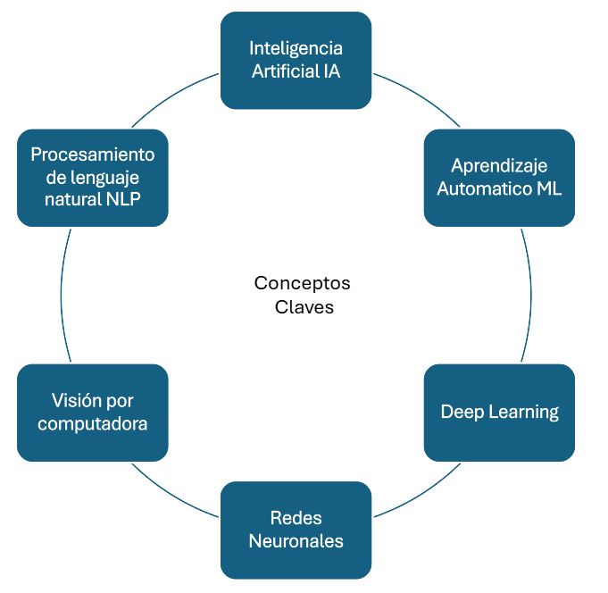
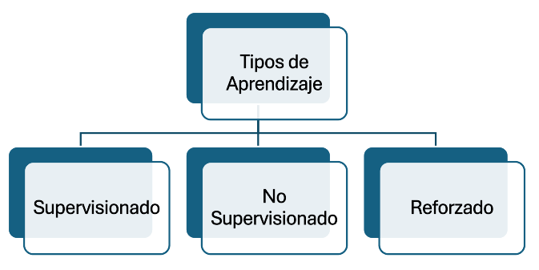
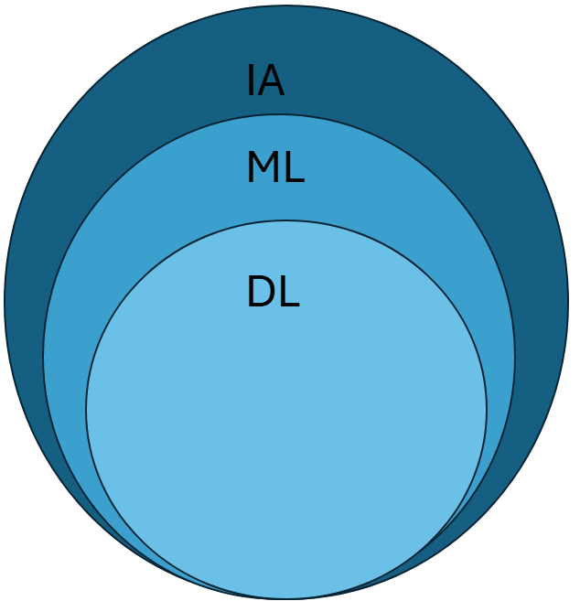
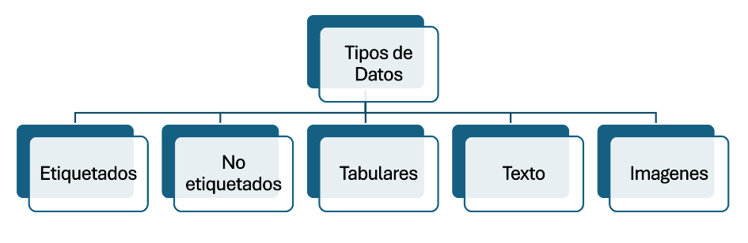

# Día 1: Introducción a la Inteligencia Artificial y el Aprendizaje Automático (AI/ML)

## Conceptos clave

### Definiciones:
- **Inteligencia Artificial (AI):** Rama de la informática que busca crear sistemas capaces de realizar tareas que normalmente requieren inteligencia humana, como reconocimiento de voz, visión, traducción y toma de decisiones.
- **Aprendizaje Automático (ML):** Subcampo de AI que permite a las máquinas aprender y mejorar de manera autónoma a partir de datos, sin necesidad de programación explícita.
- **Deep Learning (DL):** Subcampo de ML que utiliza redes neuronales profundas para modelar patrones complejos en grandes volúmenes de datos.

### Términos importantes:
- **Redes neuronales:** Conjunto de algoritmos inspirados en el cerebro humano, diseñados para reconocer patrones en los datos.
- **Visión por computadora:** Aplicación de AI para interpretar imágenes y videos, como el reconocimiento facial o la detección de objetos.
- **Procesamiento de Lenguaje Natural (NLP):** Área de AI enfocada en la interacción entre computadoras y el lenguaje humano, como chatbots o traducción automática.

## Tipos de aprendizaje:

- **Supervisado:** El modelo aprende a partir de datos etiquetados (por ejemplo, imágenes con etiquetas de “gato” o “perro”).
- **No supervisado:** El modelo encuentra patrones o agrupaciones en datos no etiquetados.
- **Reforzado:** El modelo aprende a tomar decisiones mediante prueba y error, recibiendo recompensas o castigos (usado en juegos o robots).

| **Tipo de Aprendizaje**       | **Descripción**                                                                                                                                                    | **Ejemplo**                                                                                                   | **Técnicas/Componentes Comunes**                                                                                      |
|-------------------------------|--------------------------------------------------------------------------------------------------------------------------------------------------------------------|--------------------------------------------------------------------------------------------------------------|-----------------------------------------------------------------------------------------------------------------------|
| **Supervisado**               | El modelo recibe datos de entrada junto con sus etiquetas correspondientes.                                                                                       | Predecir si un correo es spam o no basándose en ejemplos previos clasificados.                               | - Regresión: Predicción de valores continuos (por ejemplo, precio de una casa).   - Clasificación: Asignación de categorías (por ejemplo, "gato" o "perro"). |
| **No Supervisado**            | El modelo recibe datos no etiquetados y encuentra patrones o relaciones por sí mismo.                                                                             | Agrupar clientes según comportamientos similares sin etiquetas previas.                                      | - Clustering (agrupamiento): Encontrar grupos en los datos (por ejemplo, k-means).   - Reducción de dimensionalidad: Simplificar conjuntos de datos complejos mientras se conservan características importantes (por ejemplo, PCA). |
| **Por Refuerzo**              | El modelo interactúa con un entorno y aprende de las recompensas o castigos que recibe por sus acciones.                                                          | Entrenar a un robot para navegar por un laberinto donde los pasos correctos obtienen puntos y los errores penalizaciones. | - Agente: El sistema que toma decisiones.   - Entorno: El contexto con el que el agente interactúa.   - Recompensas: Señales que indican si una acción fue buena o mala. |

## Diferencias entre AI, ML y DL

## Comparativa de Inteligencia Artificial, Machine Learning y Deep Learning

| **Categoría**          | **Definición**                                                                                                                                                  | **Ejemplos**                                                                                              | **Características/Relación**                                                                              |
|------------------------|----------------------------------------------------------------------------------------------------------------------------------------------------------------|----------------------------------------------------------------------------------------------------------|-----------------------------------------------------------------------------------------------------------|
| **Inteligencia Artificial (AI)** | Es un campo amplio de la informática que busca crear sistemas capaces de realizar tareas que normalmente requieren inteligencia humana, como reconocimiento de voz, toma de decisiones y resolución de problemas. | - Chatbots que responden preguntas.   - Sistemas de recomendación como Netflix.   - Vehículos autónomos. | Incluye Machine Learning y Deep Learning como subdisciplinas.                                             |
| **Machine Learning (ML)**        | Es una rama de la AI que permite a las máquinas aprender y mejorar automáticamente a partir de los datos sin ser programadas explícitamente para cada tarea.                                    | - Filtrar correos electrónicos como "spam" o "no spam".   - Reconocimiento de imágenes.               | Utiliza algoritmos para identificar patrones en los datos y tomar decisiones.                             |
| **Deep Learning (DL)**           | Es un subconjunto de Machine Learning basado en redes neuronales profundas que imitan la estructura del cerebro humano.                                                                      | - Reconocimiento facial.   - Asistentes virtuales como Alexa o Siri.   - Diagnósticos médicos.     | Requiere grandes volúmenes de datos y poder de cómputo para entrenar modelos altamente precisos.           |
| **Relación**                     | AI es el marco general, ML es una metodología dentro de AI, y DL es una técnica avanzada dentro de ML.                                                                                      |                                                                                                          |                                                                                                           |

## Tipos de datos en modelos de AI:

- **Etiquetados:** Datos con una clasificación específica, como “imagen de un perro.”
- **No etiquetados:** Datos sin clasificación previa, como una carpeta de fotos sin descripciones.
- **Tabulares:** Datos organizados en filas y columnas, como hojas de cálculo.
- **Texto:** Datos en formato escrito, como documentos o chats.
- **Imágenes:** Archivos visuales que se analizan en visión por computadora.

## Tipos de Datos

| **Tipo de Datos**             | **Definición**                                                                                                                                                    | **Ejemplos Detallados**                                                                                                                      | **Aplicación**                                                                                                                                                             |
|-------------------------------|------------------------------------------------------------------------------------------------------------------------------------------------------------------|-----------------------------------------------------------------------------------------------------------------------------------------------|---------------------------------------------------------------------------------------------------------------------------------------------------------------------------|
| **1. Datos Etiquetados (Labeled Data)** | Conjuntos de datos que incluyen tanto las entradas como las salidas deseadas, es decir, cada dato viene acompañado de una etiqueta que indica la respuesta correcta. | - **Clasificación de Imágenes:** Un conjunto de 10,000 imágenes de animales donde cada imagen está etiquetada como "perro", "gato", "pájaro", etc.   - **Análisis de Sentimientos:** Miles de reseñas de productos donde cada reseña está etiquetada como "positiva", "neutral" o "negativa". | Los datos etiquetados son fundamentales para el aprendizaje supervisado, donde el modelo aprende a mapear entradas a salidas específicas.                                 |
| **2. Datos No Etiquetados (Unlabeled Data)** | Conjuntos de datos que no tienen etiquetas asociadas, es decir, solo contienen las entradas sin información sobre las salidas deseadas.                         | - **Imágenes Sin Clasificar:** Una colección de millones de fotos descargadas de internet sin ninguna información sobre su contenido.   - **Registros de Navegación Web:** Datos que registran las páginas visitadas por usuarios sin información sobre sus preferencias o intenciones. | Se utilizan en aprendizaje no supervisado, como el clustering, donde el objetivo es encontrar estructuras o patrones inherentes en los datos sin referencias predefinidas. |
| **3. Datos Tabulares**        | Datos estructurados en forma de tablas, donde las filas representan registros y las columnas representan características o variables.                         | - **Datos de Ventas:** Una hoja de cálculo con columnas como "Fecha", "Producto", "Cantidad Vendida" y "Precio".   - **Información Demográfica:** Conjunto de datos con "Edad", "Género", "Ingresos", "Nivel Educativo". | Comunes en modelos de aprendizaje supervisado, como regresión y árboles de decisión, que manejan variables estructuradas y cuantitativas.                                   |
| **4. Datos de Texto**         | Datos en formato textual que pueden variar desde palabras individuales hasta documentos completos.                                                               | - **Artículos de Noticias:** Miles de artículos de diferentes fuentes.   - **Conversaciones en Redes Sociales:** Interacciones en plataformas como Twitter o Facebook. | Utilizados en procesamiento de lenguaje natural (NLP) para tareas como traducción automática, análisis de sentimientos y generación de texto.                            |
| **5. Datos de Imágenes**      | Datos visuales representados en formatos como JPEG, PNG, etc., que contienen información en forma de píxeles.                                                   | - **Radiografías Médicas:** Imágenes de rayos X para detectar fracturas o anomalías.   - **Fotografías de Tráfico:** Imágenes capturadas por cámaras de tráfico para identificar infracciones. | La visión por computadora utiliza datos de imágenes para tareas como reconocimiento facial, detección de objetos y segmentación de imágenes.                             |
| **6. Datos de Audio**         | Señales sonoras que pueden ser analizadas en términos de frecuencia, amplitud y tiempo.                                                                          | - **Comandos de Voz:** Grabaciones de usuarios dando comandos.   - **Sonidos Ambientales:** Grabaciones de sonidos como lluvia, tráfico o canto de aves. | El reconocimiento de voz y la clasificación de audio son aplicaciones comunes que utilizan datos de audio para interactuar con los usuarios o monitorear entornos.         |
| **7. Datos de Series Temporales** | Datos recogidos en secuencias cronológicas, donde el tiempo es una dimensión fundamental.                                                                      | - **Datos Financieros:** Registros diarios de precios de acciones, volúmenes de transacción y otros indicadores económicos.   - **Lecturas de Sensores IoT:** Datos recogidos de sensores en fábricas como temperatura, humedad, vibración. | Los modelos de series temporales, como ARIMA o LSTM, analizan estos datos para hacer predicciones basadas en patrones históricos.                                        |

